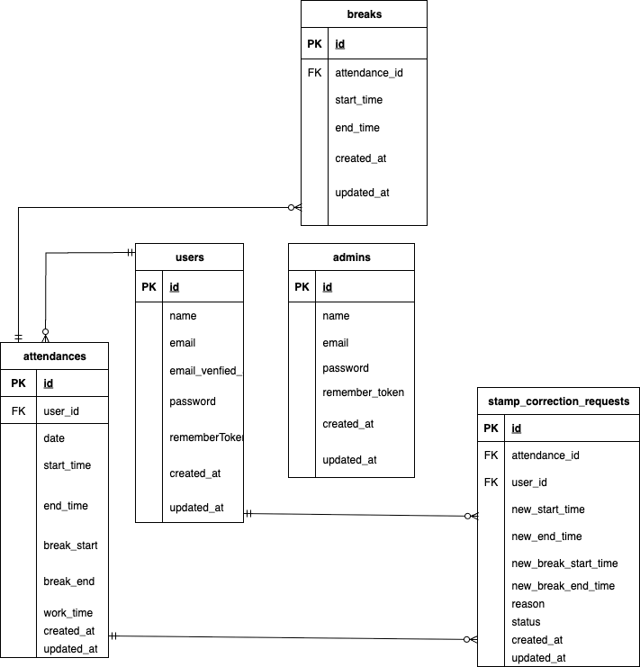

# coachtech 勤怠管理アプリ
　・ユーザーの勤怠と管理を目的とする勤怠管理アプリ
　・機能や画面がとてもシンプルで扱いやすくなっています。

## 環境構築
**Dockerビルド**
1. `git clone git@github.com:git@github.com:Estra-Coachtech/laravel-docker-template.git
2. cd contact-form
3. DockerDesktopアプリを立ち上げる
4. `docker-compose up -d --build`

> *MacのM1・M2チップのPCの場合、`no matching manifest for linux/arm64/v8 in the manifest list entries`のメッセージが表示されビルドができないことがあります。
エラーが発生する場合は、docker-compose.ymlファイルの「mysql」内に「platform」の項目を追加で記載してください*
``` bash
mysql:
    platform: linux/x86_64(この文追加)
    image: mysql:8.0.26
    environment:
```

**Laravel環境構築**
1. `docker-compose exec php bash`
2. `composer install`
3. 「.env.example」ファイルを 「.env」ファイルに命名を変更。または、新しく.envファイルを作成
4. .envに以下の環境変数を追加
``` text
DB_CONNECTION=mysql
DB_HOST=mysql
DB_PORT=3306
DB_DATABASE=laravel_db
DB_USERNAME=laravel_user
DB_PASSWORD=laravel_pass
```
5. アプリケーションキーの作成
``` bash
php artisan key:generate
```

6. マイグレーションの実行
``` bash
php artisan migrate
```

7. シーディングの実行
``` bash
php artisan db:seed
```
8. シンボリックリンク作成
``` bash
php artisan storage:link
```

## 使用技術(実行環境)
- PHP8.3.0
- Laravel8.83.27
- MySQL8.0.26

## ER図


## URL
- 開発環境：http://localhost/
- phpMyAdmin:：http://localhost:8080/


## 管理者・一般ユーザーのログイン情報

### 一般ユーザー
- メールアドレス：test@example.com  
- パスワード：password

### 管理ユーザー
- メールアドレス：admin@example.com  
- パスワード：password


## ルート

ルート内容ーーーーーーーーーーーーーーーーーーパスーーーーーーーーーーーーーーーーーーメソッドーコントローラーーーーーーアクションーーーーーー備考

メール認証通知画面                       /email/verify                     GET     匿名関数              view.               認証必須
メール認証完了処理                       /email/verify/{id}/{hash}         GET     匿名関数              $request->fulfill()   認証必須
確認メール再送信                        /email/verification-notification   POST    匿名関数              sendEmailVerificationNotification   throttleあり
勤怠更新                  /attendance/update/{id}                            POST     AttendanceController       update       一般ユーザー側
管理者：勤怠更新                  /admin/attendance/update/{id}       POST     AdminAttendanceController   update         
ログアウト                             /logout                            POST    匿名関数               -       認証必須


## テストケース

ID:1
内容:会員登録（認証機能）
テストファイル:
tests/Feature/RegisterTest.php


ID:2
内容:ログイン認証（一般ユーザー）
テストファイル:
tests/Feature/LoginTest.php


ID:3
内容:ログイン認証（管理者）
テストファイル:
tests/Feature/Admin/AdminLoginTest.php


ID:4
内容:日時取得機能
テストファイル:
tests/Feature/Attendance/DisplayCurrentDateTimeTest.php


ID:5
内容:ステータス確認
テストファイル:
tests/Feature/Attendance/AttendanceStatusDisplayTest.php


ID:6
内容:出勤機能
テストファイル:
tests/Feature/Attendance/AttendanceStartTest.php


ID:7
内容:休憩機能
テストファイル:
tests/Feature/Attendance/BreakTest.php

ID:8
内容:退勤機能
テストファイル:
tests/Feature/Attendance/LeaveWorkTest.php

ID:9
内容:勤怠一覧取得（一般ユーザー）
テストファイル:
tests/Feature/Attendance/AttendanceListTest.php

ID:10
内容:勤怠詳細取得（一般ユーザー）
テストファイル:
tests/Feature/Attendance/AttendanceDetailTest.php

ID:11
内容:勤怠詳細修正（一般ユーザー）
テストファイル:
tests/Feature/Attendance/AttendanceEditTest.php

ID:12
内容:勤怠一覧取得（管理者）
テストファイル:
tests/Feature/Attendance/AdminAttendanceListTest.php

ID:13
内容:勤怠詳細取得・修正（管理者）
テストファイル:
tests/Feature/Attendance/AdminAttendanceDetailTest.php

ID:14
内容:ユーザー情報取得（管理者）
テストファイル:
tests/Feature/Attendance/AdminUserInfoTest.php

ID:15
内容:勤怠修正申請の承認（管理者）
テストファイル:
tests/Feature/Attendance/AdminAttendanceModificationTest.php

ID:16
内容:メール認証機能
テストファイル:
tests/Feature/Auth/EmailVerificationTest.php


# .env.testing を設定してテスト用DBを用意
cp .env .env.testing
php artisan config:clear
php artisan migrate --env=testing

# 全テストを実行
php artisan test

# または PHPUnit を直接利用
vendor/bin/phpunit


# 勤怠関連テストのみ
php artisan test --testsuite=FeatureAttendance

# 個別ファイル実行例
php artisan test tests/Feature/Attendance/AttendanceListTest.php


 # マイグレーション
 add_avatar_to_users_table.php

# メール認証
メール認証誘導画面ではmailhogを実装しています。